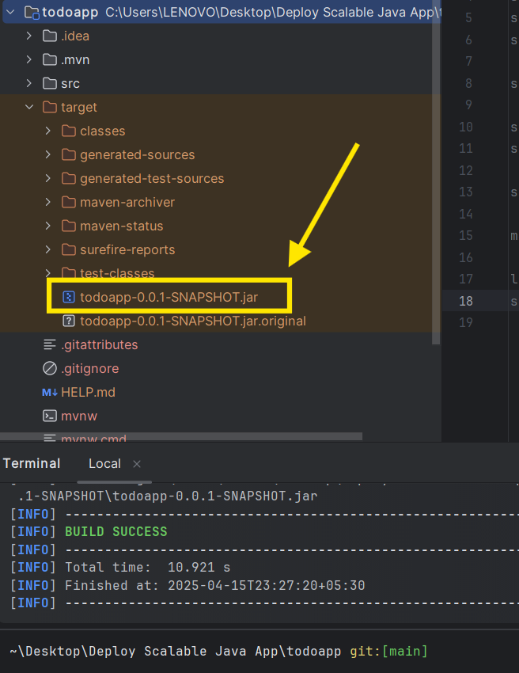
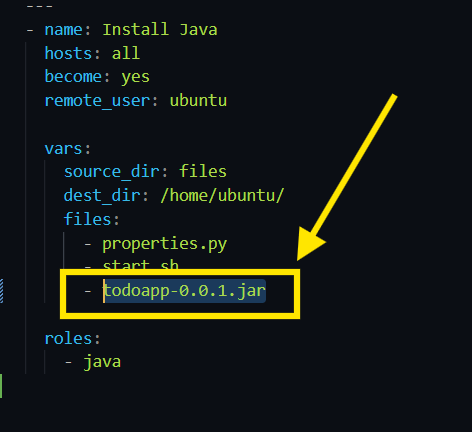
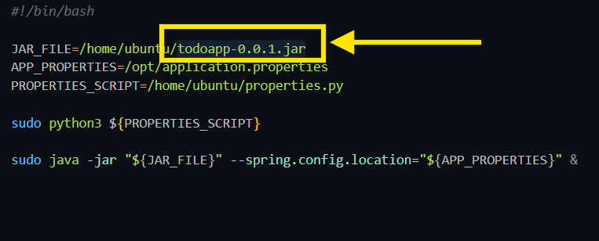
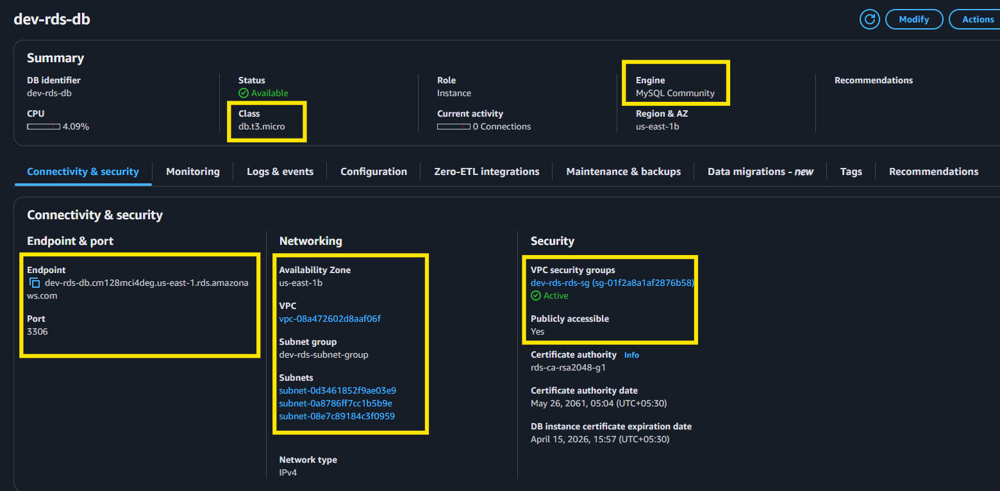
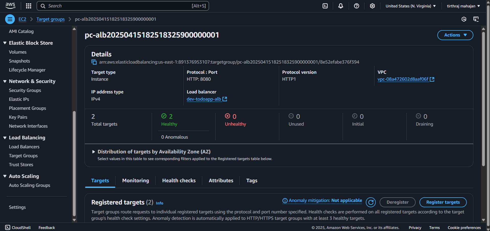
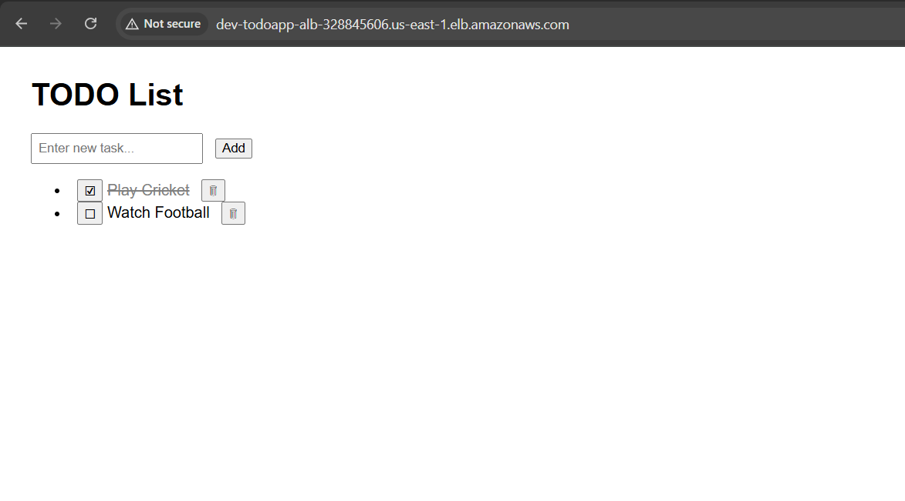

# Deploy Scalable Java Application using Ansible and Terraform

### Step 1: Install Java and Maven

Download Java
> [Download Instructions](https://www.java.com/en/download/manual.jsp)


Download Apache Maven (Optional. You can use Maven Wrapper for the next steps)
> [Download Instructions](https://maven.apache.org/install.html)


### Step 2: Build the Java Project jar file

> Note: This step is **optional** as we already have the `jar` file in the `build_files` folder.

Goto to `java_app` folder in this repo.
```bash
cd java_app
```

Build the Spring Boot app using Maven/Maven Wrapper

Using Apache Maven:
```bash
mvn clean install -DskipTests
```

Using Maven Wrapper
```bash
./mvnw clean install -DskipTests
```
Or
```bash
./mvnw.cmd clean install -DskipTests
```

After this, you should have a target folder like this:


CD into the target folder you can find the JAR file for the application. Copy that jar file in the folder called `build_files`
```bash
cd target
cp spring-petclinic-3.1.0-SNAPSHOT.jar ../../build_files
```

**`build_files` folder**:
```
root
├───build_files
│       spring-petclinic-3.1.0-SNAPSHOT.jar
```

We will use this `jar` in the next steps.

### Step 3: Use Packer & Ansible to build the AMI With application code

Copy your JAR file inside the ansible/files

```bash
cp "build_files/spring-petclinic-3.1.0-SNAPSHOT.jar" "ansible/files"
```

And we'll rename the jar file so ease of use

```bash
mv "ansible/files/spring-petclinic-3.1.0-SNAPSHOT.jar" "ansible/files/pet-clinic-1.0.1.jar"
```

Your ansible directory should look something like this:
```
ansible
│
│   java-app.pkr.hcl
│   java-app.yml
│
├───files
│       application.properties
│       pet-clinic-1.0.1.jar
│       properties.py
│       start.sh
│
├───roles
│   └───java
│       └───tasks
│               app.yml
│               backends.yml
│               cloudwatch.yml
│               java.yml
│               main.yml
│               python.yml
│
└───templates
        config.json.j2
        index.html.j2
```

Now specify the name of your JAR file in the `ansible/java-app.yml` file as shown below



### Step 4: Add AWS Access Key and Secret Key

> Important Note: It is a good practice to first create an **IAM** user with restricted access and then generate access key and secret key of that user. So in practice, always create an *IAM* user before doing this step.
> Since this is a **tutorial**, we are going to create keys from root user itself. (Bad practice when in production)

Go to security crendentials page


And then create and access key and secret key


Copy the access key and secret key somewhere safe.

Download the AWS ClI
> [Download Link](https://docs.aws.amazon.com/cli/latest/userguide/getting-started-install.html)

Verify Installation
```bash
aws --version
```
Example Output:
```
aws-cli/2.16.9 Python/3.11.8 Windows/10 exe/AMD64
```

Now configure the access key and secret key
```bash
aws configure
```


We'll need this later to run boto3 and terraform

### Step 5: Update the AWS Region

Change the region to `us-east-1` in `ansible/files/properties.py`


We will use this file **later**. Below is the description of what the files does.
```
This Python script retrieves your RDS username and password from the secret manager and RDS endpoint from the parameter store.

First it creates an ssm client and retrieves the RDS endpoint from the Parameter Store. Then it creates a secret manager client and lists the secrets in the secrets manager, then uses the name tag to identify the secret which contains the username and password from the RDS database.

It updates the ansible/files/application.properties configuration file with the username, password, and endpoint, so that your application can connect to the RDS database.
```

### Step 6: Update the Jar file name in `ansible/files/start.sh`



By running this script it will run the ansible/files/properties.py and then run the Java application and connect it with the RDS database.

### Step 7: Update the Packer template

Choose an Ubuntu AMI available in the region.
Since we are in `us-east-1`, we are going to choose AMI with AMI ID = `ami-084568db4383264d4`


Goto to `ansible/java-app.pkr.hcl` and update the region,AMI ID and instance type


### Step 8: Build your AMI
#### 8.1 Install Ansible
> [Ansible Guide](https://github.com/tirthraj07/Ansible)

##### For macOS Users
Use **Homebrew** to install Ansible:
```bash
brew install ansible
```

##### For Windows Users
Install **WSL (Windows Subsystem for Linux)** and follow the **Ubuntu** installation instructions below.
> [Install WSL on Windows](https://learn.microsoft.com/en-us/windows/wsl/install)


##### For Ubuntu Users
1. Add the Ansible PPA Repository:

```bash
sudo apt-add-repository ppa:ansible/ansible
```

You'll see a message like this:
```
Repository: 'deb https://ppa.launchpadcontent.net/ansible/ansible/ubuntu/ jammy main'
Description:
Ansible is a radically simple IT automation platform that makes your applications and systems easier to deploy. Avoid writing scripts or custom code to deploy and update your applications— automate in a language that approaches plain English, using SSH, with no agents to install on remote systems.

http://ansible.com/

If you face any issues while installing Ansible PPA, file an issue here:
https://github.com/ansible-community/ppa/issues
More info: https://launchpad.net/~ansible/+archive/ubuntu/ansible
Adding repository.
Press [ENTER] to continue or Ctrl-c to cancel.
```

> Press **Enter** when prompted.
2. Update Package Lists:

```bash
sudo apt update
```

3. Install Ansible:

```bash
sudo apt install ansible
```

4. Verify Installation:

```bash
ansible --version
```

Example output:

```
ansible [core 2.17.10]
  config file = /etc/ansible/ansible.cfg
  configured module search path = ['/home/your-user/.ansible/plugins/modules', '/usr/share/ansible/plugins/modules']
  ansible python module location = /usr/lib/python3/dist-packages/ansible
  ansible collection location = /home/your-user/.ansible/collections:/usr/share/ansible/collections
  executable location = /usr/bin/ansible
  python version = 3.10.12 (main, Feb  4 2025, 14:57:36) [GCC 11.4.0] (/usr/bin/python3)
  jinja version = 3.0.3
  libyaml = True
```
---
#### 8.2 Install Terraform

> [Terraform Guide](https://github.com/tirthraj07/Terraform)

#### Installing Terraform on Ubuntu
> Refer: https://jhooq.com/install-terrafrom/

Update apt-get package manager
```bash
sudo apt-get update && sudo apt-get install -y gnupg software-properties-common curl
```

Install official hashicorp repository
```bash
curl -fsSL https://apt.releases.hashicorp.com/gpg | sudo apt-key add -
```

```bash
sudo apt-add-repository "deb [arch=amd64] https://apt.releases.hashicorp.com $(lsb_release -cs) main" 
```

Install terraform
```bash
sudo apt-get update && sudo apt-get install terraform
```


Verify Installation

```bash
tirthraj07@LAPTOP-VGT5DGQ4:~$ terraform -v
Terraform v1.11.4
```
---
#### 8.3 Install Packer
> [Installation Guide](https://developer.hashicorp.com/packer/tutorials/docker-get-started/get-started-install-cli)

##### For Ubuntu / WSL
```bash
sudo apt install packer
```

##### For MacOS
```bash
brew install packer
```

Verify Packer Installation

```bash
packer -v
```

Output:
```
Packer v1.12.0
```
---
#### 8.4 Install Packer Plugins
```bash
packer init java-app.pkr.hcl
```

Example Output:
```
Installed plugin github.com/hashicorp/amazon v1.3.6 in "/home/tirthraj07/.config/packer/plugins/github.com/hashicorp/amazon/packer-plugin-amazon_v1.3.6_x5.0_linux_amd64"
Installed plugin github.com/hashicorp/ansible v1.1.3 in "/home/tirthraj07/.config/packer/plugins/github.com/hashicorp/ansible/packer-plugin-ansible_v1.1.3_x5.0_linux_amd64"
```
---

#### 8.5 Validate the packer template
```bash
packer validate java-app.pkr.hcl
```

Expected Output:
```
The configuration is valid.
```
---
#### 8.6 Build AMI

If template is valid, build your AMI using the command
```bash
packer build java-app.pkr.hcl
```

> It may take 15+ minutes to provision

Example output:
```
==> amazon-ebs.java-app: Prevalidating any provided VPC information
==> amazon-ebs.java-app: Prevalidating AMI Name: PACKER-java-app-1.0.1
    amazon-ebs.java-app: Found Image ID: ami-084568db4383264d4
==> amazon-ebs.java-app: Creating temporary keypair: packer_67fe2706-60cc-fb1a-60a5-2e7e0dfa78b9
==> amazon-ebs.java-app: Creating temporary security group for this instance: packer_67fe270b-0620-e1fb-bf71-7f5dd1f25ed9
==> amazon-ebs.java-app: Authorizing access to port 22 from [0.0.0.0/0] in the temporary security groups...
==> amazon-ebs.java-app: Launching a source AWS instance...
    amazon-ebs.java-app: Instance ID: i-00575333e8958e4fa
==> amazon-ebs.java-app: Waiting for instance (i-00575333e8958e4fa) to become ready...
...

    amazon-ebs.java-app: PLAY [Install Java] ************************************************************
    amazon-ebs.java-app:
    amazon-ebs.java-app: TASK [Gathering Facts] *********************************************************
    amazon-ebs.java-app: [WARNING]: Platform linux on host default is using the discovered Python
    amazon-ebs.java-app: interpreter at /usr/bin/python3.12, but future installation of another Python
    amazon-ebs.java-app: interpreter could change the meaning of that path. See
    amazon-ebs.java-app: https://docs.ansible.com/ansible-
    amazon-ebs.java-app: core/2.17/reference_appendices/interpreter_discovery.html for more information.
    amazon-ebs.java-app: ok: [default]
    ...
    amazon-ebs.java-app: TASK [java : Install JRE] ******************************************************
    amazon-ebs.java-app: changed: [default]
    amazon-ebs.java-app:
    amazon-ebs.java-app: TASK [java : Create log file] **************************************************
    amazon-ebs.java-app: changed: [default]
    amazon-ebs.java-app:
    amazon-ebs.java-app: TASK [java : include_tasks] ****************************************************
    amazon-ebs.java-app: included: /mnt/c/Users/LENOVO/Desktop/Deploy Scalable Java App/ansible/roles/java/tasks/python.yml for default
    amazon-ebs.java-app:
    amazon-ebs.java-app: TASK [java : Install Python3 and pip3] *****************************************
    amazon-ebs.java-app: ok: [default] => (item=python3)
    amazon-ebs.java-app: changed: [default] => (item=python3-pip)
    amazon-ebs.java-app:
    amazon-ebs.java-app: TASK [java : Install AWS CLI using pip3] ***************************************
    amazon-ebs.java-app: changed: [default]
    amazon-ebs.java-app:
    amazon-ebs.java-app: TASK [java : Install boto3 using pip3] *****************************************
    amazon-ebs.java-app: changed: [default]
    amazon-ebs.java-app:
    amazon-ebs.java-app: TASK [java : include_tasks] ****************************************************
    amazon-ebs.java-app: included: /mnt/c/Users/LENOVO/Desktop/Deploy Scalable Java App/ansible/roles/java/tasks/backends.yml for default
    amazon-ebs.java-app:
    amazon-ebs.java-app: TASK [java : Check operating system] *******************************************
    amazon-ebs.java-app: ok: [default] => {
    amazon-ebs.java-app:     "msg": "The operating system is Debian"
    amazon-ebs.java-app: }
    ...
    amazon-ebs.java-app: TASK [java : Copy files] *******************************************************
    amazon-ebs.java-app: changed: [default] => (item=properties.py)
    amazon-ebs.java-app: changed: [default] => (item=start.sh)
    amazon-ebs.java-app: changed: [default] => (item=pet-clinic-1.0.1.jar)
    amazon-ebs.java-app:
    amazon-ebs.java-app: TASK [java : Copy files] *******************************************************
    amazon-ebs.java-app: changed: [default]
    amazon-ebs.java-app:
    amazon-ebs.java-app: TASK [java : Make start.sh script executable] **********************************
    amazon-ebs.java-app: changed: [default]
    amazon-ebs.java-app:
    amazon-ebs.java-app: PLAY RECAP *********************************************************************
    amazon-ebs.java-app: default                    : ok=24   changed=16   unreachable=0    failed=0    skipped=0    rescued=0    ignored=0
    ...
```

Finally you should get the following output


Verfiy the AMI Creation in AWS Console
Goto `AWS Console > AMIs` and select `Owned by me`


Store the AMI ID for Future use
Example
```
AMI ID: ami-06a849adb93917d43
```

Once your AMI is provisioned move on to the next process.
---

### Step 9: RDS Provisioning
After provisioning the AMI, start provisioning the RDS database for the application.

Go to `AWS Console > VPC > Your VPCs` and copy the VPC ID


For example:
```
VPC ID = vpc-08a472602d8aaf06f
```

Goto `AWS Console > VPC > Subnets` and Choose 2 or more subnets in the chosen VPC


For example:
```
Subnet IDs:
subnet-08e7c89184c3f0959
subnet-0a8786ff7cc1b5b9e
subnet-0d3461852f9ae03e9
```

CD into the terraform folder and follow the steps.

```bash
cd terraform
```

In `vars/rds.tfvars` update the Region, VPC Id and Subnet Ids


After modifying terraform/vars/rds.tfvars with your configurations, initialize Terraform inside the terraform/rds folder.

```bash
cd terraform/rds
```

Initialize Terraform
```bash
terraform init
```

Expected Output:
```
Initializing the backend...
Initializing modules...
- rds in ../modules/rds
Initializing provider plugins...
- Finding latest version of hashicorp/aws...
- Installing hashicorp/aws v5.94.1...
- Installed hashicorp/aws v5.94.1 (signed by HashiCorp)
Terraform has created a lock file .terraform.lock.hcl to record the provider
selections it made above. Include this file in your version control repository
so that Terraform can guarantee to make the same selections by default when
you run "terraform init" in the future.

Terraform has been successfully initialized!
```

Plan Terraform
```bash
terraform plan -var-file=../vars/rds.tfvars
```

Expected Output
```
Terraform used the selected providers to generate the following execution plan. Resource actions are indicated with the
following symbols:
  + create

Terraform will perform the following actions:

  # module.rds.aws_db_instance.rds_instance will be created
  + resource "aws_db_instance" "rds_instance" {
      ...
    }

  # module.rds.aws_db_subnet_group.rds_subnet_group will be created
  + resource "aws_db_subnet_group" "rds_subnet_group" {
      ...
    }

  # module.rds.aws_security_group.rds_security_group will be created
  + resource "aws_security_group" "rds_security_group" {
      ...
      + vpc_id                 = "vpc-08a472602d8aaf06f"
    }

  # module.rds.aws_ssm_parameter.rds_endpoint will be created
  + resource "aws_ssm_parameter" "rds_endpoint" {
        ...
    }

Plan: 4 to add, 0 to change, 0 to destroy.
```

Apply Terraform

```bash
terraform apply -var-file=../vars/rds.tfvars
```

> Note: This may take upto 10 minutes

Expected Output:
```
module.rds.aws_db_subnet_group.rds_subnet_group: Refreshing state... [id=dev-rds-subnet-group]
module.rds.aws_security_group.rds_security_group: Refreshing state... [id=sg-01f2a8a1af2876b58]

Terraform used the selected providers to generate the following execution plan. Resource actions are indicated with the following symbols:
  + create

Terraform will perform the following actions:

  # module.rds.aws_db_instance.rds_instance will be created
  + resource "aws_db_instance" "rds_instance" {
      ...
    }

  # module.rds.aws_ssm_parameter.rds_endpoint will be created
  + resource "aws_ssm_parameter" "rds_endpoint" {
      ...
    }

Plan: 2 to add, 0 to change, 0 to destroy.

Do you want to perform these actions?
  Terraform will perform the actions described above.
  Only 'yes' will be accepted to approve.

  Enter a value: yes

module.rds.aws_db_instance.rds_instance: Creating...
module.rds.aws_db_instance.rds_instance: Still creating... [9s elapsed]
...
module.rds.aws_db_instance.rds_instance: Still creating... [6m33s elapsed]
module.rds.aws_db_instance.rds_instance: Creation complete after 6m35s [id=db-5XXGTQM5WXQEHM5B67CMEMSDFI]
module.rds.aws_ssm_parameter.rds_endpoint: Creating...
module.rds.aws_ssm_parameter.rds_endpoint: Creation complete after 2s [id=/dev/petclinic/rds_endpoint]

Apply complete! Resources: 2 added, 0 changed, 0 destroyed.
```

After the code runs successfully, validate that the RDS database has provisioned and active. Also check if the RDS endpoint is stored in the Parameter Store.

Goto `AWS Console > Aurora and RDS > Databases`


Check the Configuration of RDS


Example
```
Endpoint: dev-rds-db.cm128mci4deg.us-east-1.rds.amazonaws.com
Port: 3306
```

Now, Check the Parameter Store for RDS Endpoint
Goto `AWS Console > AWS Systems Manager > Parameter Store`


Search for /dev/petclinic/rds_endpoint.


Now, Check the Secrets Manager
Goto `AWS Console > AWS Secrets Manager > Secrets`


Click on the secret to view the values. You should see:


Your app can retrieve these secrets programmatically using the AWS SDKs. The username and password are used to authenticate the app when connecting to RDS.

### Step 10: ALB and ASG Provisioning

After provisioning the RDS database, start provisioning the ALB and ASG by following the steps below.


Modify `terraform/vars/alb-asg.tfvars` file

CD into the `terraform/vars/` folder and update the `alb-asg.tfvars` fill with vpc, subnets, ami-id, key, and other configurations with your configuration.

Update the region id, vpc and subnets


Update the AMI ID to one we built during Step 8.6


Now you need to create a keypair on AWS or use an existing Key Pair
Goto `AWS Console > EC2 Dashboard > Key Pairs`


After that, just copy the name of the keypair and paste it in the `key_name`


Each instance will have an IAM role attached to it while provisioning. I attached an IAM role with admin permissions, you can modify the IAM role in the /terraform/modules/alb-asg/iam-policy.tf file with the permissions you require.

After modifying alb-asg.tfvars with your configurations, initialize Terraform inside the terraform/alb-asg folder.

```bash
cd alb-asg/
```

Terraform Initialize
```bash
terraform init
```

Expected Output
```
Initializing the backend...
Initializing modules...
- alb-asg in ../modules/alb-asg
Initializing provider plugins...
- Finding latest version of hashicorp/aws...
- Installing hashicorp/aws v5.94.1...
- Installed hashicorp/aws v5.94.1 (signed by HashiCorp)
Terraform has created a lock file .terraform.lock.hcl to record the provider
selections it made above. Include this file in your version control repository
so that Terraform can guarantee to make the same selections by default when
you run "terraform init" in the future.

Terraform has been successfully initialized!
```

Terraform Plan

```bash
terraform plan -var-file=../vars/alb-asg.tfvars
```

Expected Output

```
Terraform used the selected providers to generate the following execution plan. Resource actions are indicated with the
following symbols:
  + create

Terraform will perform the following actions:

  # module.alb-asg.aws_alb.application_load_balancer will be created
  + resource "aws_alb" "application_load_balancer" {
      ...
    }

  # module.alb-asg.aws_alb_listener.application_listener will be created
  + resource "aws_alb_listener" "application_listener" {
      ...
    }

  # module.alb-asg.aws_alb_target_group.petclinic will be created
  + resource "aws_alb_target_group" "petclinic" {
        ...
    }

  # module.alb-asg.aws_autoscaling_attachment.petclinic will be created
  + resource "aws_autoscaling_attachment" "petclinic" {
      ...
    }

  # module.alb-asg.aws_autoscaling_group.petclinic will be created
  + resource "aws_autoscaling_group" "petclinic" {
        ...
    }

  # module.alb-asg.aws_autoscaling_policy.cpu_scaling_policy will be created
  + resource "aws_autoscaling_policy" "cpu_scaling_policy" {
      ...
    }

  # module.alb-asg.aws_iam_instance_profile.instance_profile will be created
  + resource "aws_iam_instance_profile" "instance_profile" {
      ...
    }

  # module.alb-asg.aws_iam_policy.iam_policy will be created
  + resource "aws_iam_policy" "iam_policy" {
      ...
    }

  # module.alb-asg.aws_iam_role.iam_role will be created
  + resource "aws_iam_role" "iam_role" {
      ...
    }

  # module.alb-asg.aws_iam_role_policy_attachment.iam_role_policy_attachment will be created
  + resource "aws_iam_role_policy_attachment" "iam_role_policy_attachment" {
      ...
    }

  # module.alb-asg.aws_launch_template.petclinic_lt will be created
  + resource "aws_launch_template" "petclinic_lt" {
      ...
    }

  # module.alb-asg.aws_security_group.alb_sg will be created
  + resource "aws_security_group" "alb_sg" {
        ...
    }

  # module.alb-asg.aws_security_group.instance_sg will be created
  + resource "aws_security_group" "instance_sg" {
        ...
    }

Plan: 13 to add, 0 to change, 0 to destroy.
```

Start provisioning ALB and ASG

```bash
terraform apply -var-file=../vars/alb-asg.tfvars
```

Expected Output:
```
...
Plan: 3 to add, 1 to change, 0 to destroy.

Do you want to perform these actions?
  Terraform will perform the actions described above.
  Only 'yes' will be accepted to approve.

  Enter a value: yes

module.alb-asg.aws_launch_template.petclinic_lt: Modifying... [id=lt-08d3121eb220d25ab]
module.alb-asg.aws_launch_template.petclinic_lt: Modifications complete after 8s [id=lt-08d3121eb220d25ab]
module.alb-asg.aws_autoscaling_group.petclinic: Creating...
module.alb-asg.aws_autoscaling_group.petclinic: Still creating... [8s elapsed]
module.alb-asg.aws_autoscaling_group.petclinic: Still creating... [18s elapsed]
module.alb-asg.aws_autoscaling_group.petclinic: Still creating... [28s elapsed]
module.alb-asg.aws_autoscaling_group.petclinic: Still creating... [38s elapsed]
module.alb-asg.aws_autoscaling_group.petclinic: Creation complete after 39s [id=dev-pet-clinic-asg]
module.alb-asg.aws_autoscaling_attachment.petclinic: Creating...
module.alb-asg.aws_autoscaling_policy.cpu_scaling_policy: Creating...
module.alb-asg.aws_autoscaling_attachment.petclinic: Creation complete after 1s [id=dev-pet-clinic-asg-20250415111538526100000002]
module.alb-asg.aws_autoscaling_policy.cpu_scaling_policy: Creation complete after 1s [id=dev-pet-clinic-cpu-scaling-policy]

Apply complete! Resources: 3 added, 1 changed, 0 destroyed.
```

### Step 11: Check ALB and ASG Status and Website
After the code runs successfully, validate ALB and ASG has provisioned. And you can check the health of your instance in the target group.

Goto `AWS Console > EC2 > Load balancers`




